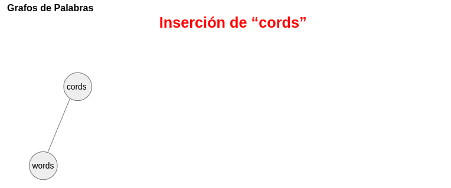
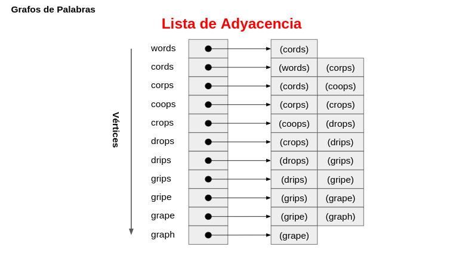

<div align="center">
<table>
    <theader>
        <tr>
            <td></td>
            <th>
                <span style="font-weight:bold;">UNIVERSIDAD NACIONAL DE SAN AGUSTIN</span><br />
                <span style="font-weight:bold;">FACULTAD DE INGENIERÍA DE PRODUCCIÓN Y SERVICIOS</span><br />
                <span style="font-weight:bold;">ESCUELA PROFESIONAL DE INGENIERÍA DE SISTEMAS</span>
            </th>
            <td></td>
        </tr>
    </theader>
    <tbody>
        <tr><td colspan="3"><span style="font-weight:bold;">Formato</span>: Guía de Práctica de Laboratorio / Talleres / Centros de Simulación</td></tr>
        <tr><td><span style="font-weight:bold;">Aprobación</span>:  2022/03/01</td><td><span style="font-weight:bold;">Código</span>: GUIA-PRLD-001</td><td><span style="font-weight:bold;">Página</span>: 1</td></tr>
    </tbody>
</table>
</div>

<div>
<span style="font-weight:bold;">INFORME DE LABORATORIO</span><br />

<table>
<theader>
<tr><th colspan="6">INFORMACIÓN BÁSICA</th></tr>
</theader>
<tbody>
<tr><td>ASIGNATURA:</td><td colspan="5">Estructura de Datos y Algoritmos</td></tr>
<tr><td>TÍTULO DE LA PRÁCTICA:</td><td colspan="5">Grafos</td></tr>
<tr>
<td>NÚMERO DE PRÁCTICA:</td><td>08</td><td>AÑO LECTIVO:</td><td>2022 A</td><td>NRO. SEMESTRE:</td><td>III</td>
</tr>
<tr>
<td>FECHA DE PRESENTACIÓN:</td><td>21/08/2022</td><td>HORA DE PRESENTACIÓN:</td><td colspan="3"></td>
</tr>
<tr><td colspan="3">INTEGRANTE(s):
<ul>
<li>Cárdenas Martínez Franco Luchiano - fcardenasm@unsa.edu.pe</li>
<li>Carrillo Daza Barbara Rubi - bcarrillo@unsa.edu.pe</li>
<li>Diaz Portilla Carlo Rodrigo - cdiazpor@unsa.edu.pe</li>
<li>Hancco Condori Bryan Orlando - bhanccoco@unsa.edu.pe</li>
<li>Mamani Cañari Gabriel Antony - gmamanican@unsa.edu.pe</li>
</ul>
</td>
<td>NOTA:</td><td colspan="2"></td>
</<tr>
<tr><td colspan="6">DOCENTE(s):
<ul>
<li>Richart Smith Escobedo Quispe - rescobedoq@unsa.edu.pe</li>
</ul>
</td>
</<tr>
</tbody>
</table>

<!-- Reportes -->
## SOLUCIÓN Y RESULTADOS

---

I. SOLUCIÓN DE EJERCICIOS/PROBLEMAS <br>
* La organización del repositorio es la siguiente
    ```sh
    ```
  * **Nota :** Para los ver los ejercicios propuestos deberá compilar y ejecutar "Test.java".
* **Implementacion del grafo**
	```java
	//Código resaltante
	```
* **Implementacion del BSF y DFS** 
  ```java
	//Código resaltante
	```   
* **Implementación de Dijkstra** 
  ```java
	//Código resaltante
	```
* **Solución del ejercicio**
  - Dentro de Un grafo de palabras, cada vertice es una palabra, siendo 2 palabras adyacentes si solamente difieren
    en una posición.
  - El grafo definido las palabras: words, cords, corps, coops, crops, drops, drips, grips, gripe, grape, graph. Resulta.
  	
	
	
	
	
	
	
	
	
	
	
  - La resultante lista de adyacencia es:
	
* **Método adicional** 
  ```java
	//Código resaltante
	```  
II. Cuestionario
* ¿Cuantas variantes del algoritmo de Dijkstra hay y cuál es la diferencia entre ellas?
  
*  Invetigue sobre los ALGORITMOS DE CAMINOS MINIMOS e indique, ¿Qué similitudes encuentra, 
   qué diferencias, en qué casos utilizar y porque?
  
III. CONCLUSIONES

- 
- 
- 
- 

---

## RETROALIMENTACIÓN GENERAL
 <pre>

 </pre>
---

### REFERENCIAS Y BIBLIOGRAFÍA
<ul>
    <li>https://www.w3schools.com/java/</li>
    <li>https://www.eclipse.org/downloads/packages/release/2022-03/r/eclipse-ide-enterprise-java-and-web-developers</li>
    <li>https://docs.oracle.com/javase/tutorial/java/generics/types.html</li>
</ul>
